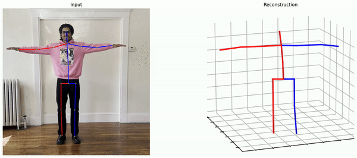

# 3D Human Pose Estimation using LSTM and Transformer based models

A powerful and flexible framework for 3D human pose estimation, leveraging the strengths of LSTM and transformer-based networks, inspired by the state-of-the-art research in the field.



## Acknowledgements

A significant portion of the code related to data processing and visualization is derived from the following outstanding projects:
- [PoseFormerV2 by QitaoZhao](https://github.com/QitaoZhao/PoseFormerV2)
- [VideoPose3D by Facebook Research](https://github.com/facebookresearch/VideoPose3D)
- [3D Pose Baseline by una-dinosauria](https://github.com/una-dinosauria/3d-pose-baseline)

Big shoutout to the contributors of these projects for their exceptional work!

Also, huge thanks to my project partners - Bargav, Akshat, and Mounika. It wouldn't have been possible to accomplish this task without there help.

## Environment Setup

This project has been developed and tested with the following environment:

- **Python**: 3.9
- **PyTorch**: 1.13.0
- **CUDA**: 11.7

To set up your environment, follow these steps:

```bash
conda create -n 3dposenet python=3.9
conda activate 3dposenet
pip install torch==1.13.0+cu117 torchvision==0.14.0+cu117 torchaudio==0.13.0 --extra-index-url https://download.pytorch.org/whl/cu117
pip install -r requirements.txt
```

### Dataset preparation: Human3.6M

Please refer to [VideoPose3D](https://github.com/facebookresearch/VideoPose3D) to set up the Human3.6M dataset as follows:

```
code_root/
└── data/
	├── data_2d_h36m_gt.npz
	├── data_2d_h36m_cpn_ft_h36m_dbb.npz
	└── data_3d_h36m.npz
```

### Training

You can train our model on a single GPU with the following command:

```bash
python train.py
```

The training script includes several configurable parameters, allowing you to experiment with different setups. The current configuration is as follows:


```bash
batch_size = 512
num_input_frames = 81
num_epoch = 15
lr = 0.0001
model_pos = LSTM_PoseNet(num_joints, num_frames=receptive_field, input_dim=2, output_dim=3)

checkpoint = 'checkpoint'

```

The model processes 81 frames at a time, dividing a video into overlapping windows of 81 frames. But feel free to experiment on this parameter.

## Video Demo

First, you need to download the pretrained weights for YOLOv3 ([here](https://drive.google.com/file/d/1YgA9riqm0xG2j72qhONi5oyiAxc98Y1N/view?usp=sharing)), HRNet ([here](https://drive.google.com/file/d/1YLShFgDJt2Cs9goDw9BmR-UzFVgX3lc8/view?usp=sharing)) and put them in the `./demo/lib/checkpoint` directory. Then, put your in-the-wild videos in the `./demo/video` directory. 

Show correct checkpoint path (from the trained model) in `vis.py` and Run the command below:

```bash
python demo/vis.py --video sample_video.mp4
```

## Evaluation

Our models achieved the following performance on the Human3.6M benchmark using the MPJPE evaluation metric:

	•	LSTM_PoseNet: 55 mm
	•	Transformer-based models: 64 mm


The current state-of-the-art (SOTA) performance on this benchmark is around 30 mm, as reported in this paper ([here](https://arxiv.org/pdf/2401.09836))


